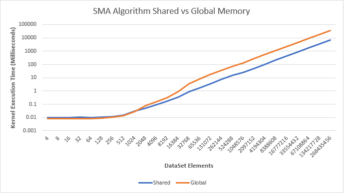
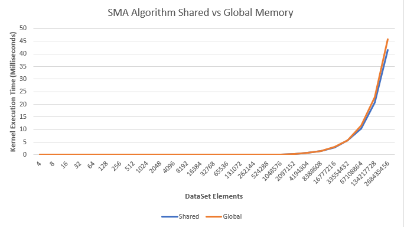
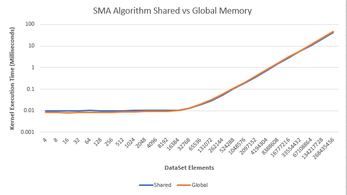
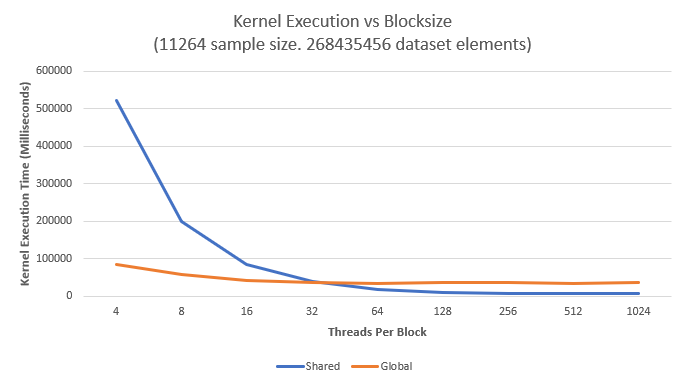
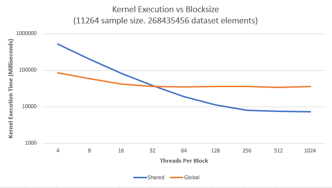

# Cuda Simple Moving Average (SMA) #

The purpose of this program is to benchmark the performance of using the GPU's shared memory, compared to just using the global memory. 
To see how to use this program, please read the [Example Usage](EXAMPLE_USAGE.md) doc.

## Performance of Shared Memory over Global Memory
Currently, memory bandwidth is the limiting factor for performing faster computations, not processing power. In other words, it is much slower to access a byte of data from Global Memory, than it is to perform a floating point operation with data stored on a streaming processor's register. NVIDIA has three main types of memory, Global, Shared, and Local (registers). Shared memory is only available on a per-block basis, whereas global memory is shared among all blocks in a kernel. If an algorithm has multiple reads from a set of data in global memory, it can usually be improved by copying the data from global to shared memory, then preforming the operations on shared memory. 

Both of the algorithms are agnostic to the number of threads per block. Meaning you can set threads per block to be whatever size you feel like. However, if you're using the shared memory algorithm, you will most likely gain more performance if you have a larger block size, because there will be fewer copies to shared memory. 

## Benchmark Mode Results
Tested with a GTX 980, which has 49152 bytes of shared memory per block, I was able to create the following benchmarks:

### Testing Sample Size 

Initially, a random dataset that contained 4 elements was generated and the samplesize was initially set to 2. Each iteration of the test, the dataset size and the samplesize were doubled. Once the samplesize maxed out shared memory, it remained constant at the maximum amount that would fit in shared memory, which in my specific case was 11264 *(which happened when the dataset size was 32768 elements in size)*. Even as the dataset size continued to double, the samplesize remained 11264. If it did not, the two algorithms could not be compared to each other. Only the global memory algorithm would work. 

The following is the results on both a linear and logarithmic scale:

At the final iteration, when the data set contained 268,435,456 elements (and the sample size being 11264), the shared memory version of the algorithm had a 80.7% decrease in execution time over its global memory only counterpart taking only 6.7 seconds to execute instead of 34.8 seconds. 

Of course, this is an extreme example. In most cases, when people are computing a simple moving average, they'll typically select a small sample period. A very common one is 16, so we'll test it with that. In this scenario, the algorithm did not perform as well. with the larger sample_size.

Again at the final iteration, the dataset contained 268,435,456 elements (except this time the samplesize was 16). The shared memory version of the algorithm only has a 9.5% decrease in execution time. (Shared memory took 41.5 milliseconds. Global memory version took 45.9 milliseconds). 

### Testing Blocksize Size 

When testing how blocksize impacts preformance, the samplesize was set to 11264, and the number of dataset elements was set to 268,435,456. The only thing changed was the threads per blocks. The following are Linear and Logarithmic graphs of increasing blocksize. 

It's clear that larger blocksizes improve preformance. The larger the blocksize, the fewer copies from global to shared memory are needed.

### Conclusion

The shared memory algorithm is mostly efficient for high sample_size values and high threads per block values. 